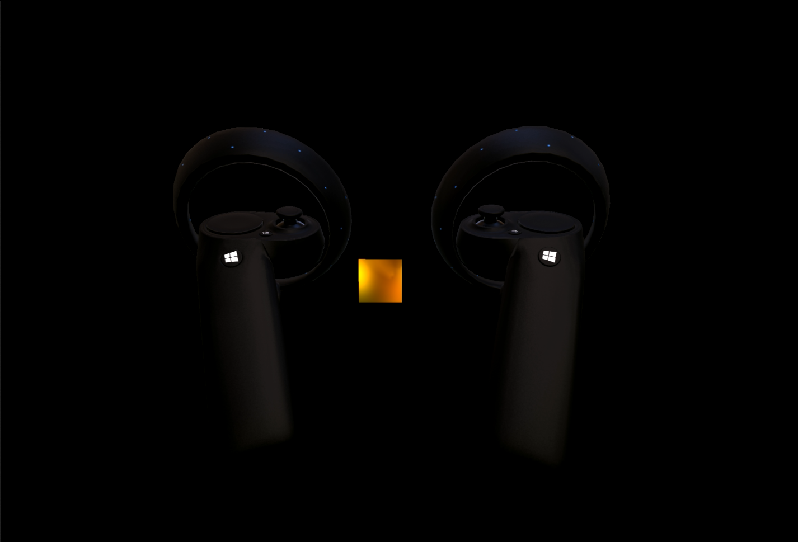

# Render Controller Sample

## Description

The Render Controller Sample is a UWP application which demonstrates how to load and render the Mixed-Reality motion controller models provided by the system through the TryGetRenderableModelAsync API. Features and best practices demonstrated include:
* Loading a glTF 2.0 model
* PBR rendering
* Controller articulation of buttons, touchpad and thumbstick
* Best practices for model caching
* Best practices for rendering motion controllers without latency
* Using a fall-back model when no model is provided by the system
* Rendering the controller rooted at the correct pose

This sample is written using the recently released C++/WinRT library instead of C++/CX. This requires using the latest features provided by C++17.

## Details

3D models are provided for Mixed-Reality motion controllers in the [glTF 2.0](https://github.com/KhronosGroup/glTF/tree/master/specification/2.0) GLB binary format, an open standard for 3D models. glTF uses a Physically-Based Rendering (PBR) material system, specifically using a Metallic-Roughness model. To support loading and rendering glTF 2.0 media, the sample relies on additional projects and open-sourced libraries:
* [TinyGLTF](https://github.com/syoyo/tinygltf) - A header only C++ glTF 2.0 library.
* Gltf - Helper functions to parse data returned by TinyGLTF.
* Pbr - Shaders and code for creating and rendering models in DirectX 11 using the PBR Metallic-Roughness model.
* SpatialInputUtilities - Utilities for handling spatial input sources including motion controllers.

The ControllerRenderer class in the sample project manages everything needed to load and render controller models.

## Controller Model Loading

When a new interaction source is detected (a SourceDetected event is raised), a controller model cache is used. See the ControllerModelCache class and GetControllerModelKey function for caching functionality. If there is a cache hit, the previously loaded model is cloned. If there is a cache miss, the binary data returned by TryGetRenderableModelAsync is parsed. See GltfLoader.cpp (Pbr project) for glTF loading functionality. The model that is loaded should be associated with spatial interaction source through its Id property which uniquely identifies the interaction source for its lifetime (note: an interaction source identifier may be reused for the same device when lost and detected again).

**Caching best practice**: To avoid potentially reloading an existing controller model, a caching key is required. The recommended properties to use to cache a controller model are a tuple of VendorId, ProductId, Version and Handedness.

## Controller Model Rendering

To render a controller in the correct position, a few things must be done. The first is that GetDetectedSourcesAtTimestamp must be called using the timestamp from the HolographicFrame's CurrentPrediction property. This will provide interaction sources at their predicted pose when the frame will be presented to the user. A common mistake is to use the values from the SourceUpdated event will result in controllers rendered with at their last known location, which has higher latency, rather than future predicted location.

For each interaction source, get the grasp location by calling TryGetLocation on the interaction source's Properties. If a location with position and orientation is available, look up the model for this interaction source based on its Id property.

The model can optionally be articulated to match its real-world state. Articulation is provided in ControllerRendering.cpp in the SpatialInputUtilities project. Using the well-known named nodes in the glTF file, local transforms are interpolated based on the state of the controller.

Finally, rendering the model at the pose returned by TryGetLocation will result in a model rendered in the place in the scene.

## System Requirements

*Client:* Windows 10 Fall Creators Update (10.0.16299.0 or newer).
*Visual Studio:* Visual Studio 2017  Version 15.4 or newer.
*Windows SDK:* Windows 10  Fall Creators Update SDK.

## Build and run the sample

1. Clone the repo.
2. Open ControllerRenderSample.sln
3. Change the active solution platform to X64.
4. Select **Build** \> **Build Solution** to build or **Debug** \> **Start Without Debugging** to run.